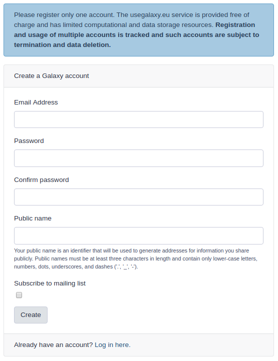
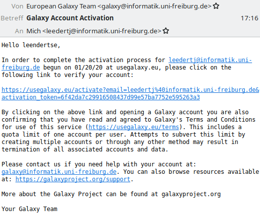

# Protokollierung der Registrierung

https://usegalaxy.eu/login

Klick auf Link `Registrieren`

Mit Links zur GDPR

Links:

- https://usegalaxy.eu/terms/privacy-policy.html
- https://usegalaxy.eu/terms/tos.html
- https://usegalaxy.eu/terms/gdpr-rights.html
- https://usegalaxy.eu/terms/lia/
- https://usegalaxy.eu/terms/gdpr-docs.html
- https://usegalaxy.eu/terms/dpa/

Bei Registrierung Mailingliste bestellt.

Im Formular Daten erfasst:

- „Email Address“
- Password (with confirmation)
- Public name (nur zeichentechnische Vorgaben)

GDRP-Regelwerke müssen nicht aktiv abgenickt werden.

Verifikation der zugesendeten Mail wird erwartet:

Mail mit der Bitte um Verifizierung:

Darin wird erklärt, dass mit Klick des Links man den Bedingungen zustimmt.

Im Browser dann die Bestätigung des Erfolgs der Verifikation.

Weitere Mail erklärt Aufnahme in Mailingliste:

