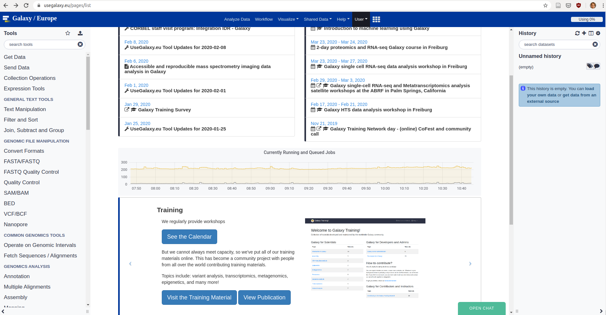

# Erklärungen für Externe hinsichtlich Datenschutz

Galaxy aus Sicht der GDPR eine *harte Nuss*

Plattform für Community der *Bioinformatiker*

Teil der de.NBI-Cloud, Projekt gefördert vom BMBF

*Galaxy Group Freiburg* ist Teil des Lehrstuhls für Bioinformatik: Lehre für Uni, hauptsächlich Community-Building (Workshops) und Plattform-Pflege

Verwendung von Open-Source auf Open-Source-Plattformen und Hardware, die in Universitäten in Deutschland untergestellt ist

Plattformen so weit abstrahiert, dass für die Nutzer:in der Übergang in andere Systeme nicht immer erkennbar ist

Ausführungsort von Jobs automatisiert, so dass nicht „vorhersagbar“, auf welchem Server er ausgeführt wird <!--Hier die Frage, ob alle beteiligten Ressourcen für Jobausführung über de.NBI/Elixir in Europa (GDPR) gehalten werden-->

Webseiten entstehen im Mashup aus verschiedenen Quellen

Mehrwert der Seite entsteht aus

- Zugang zu Hardwareressourcen ohne komplexe universitäre Genehmigungsprozedur: HPC, Storage
- Sichtbarkeit in Community
- Sharing von Software, Tools und besonders Workflows
- Nutzbarkeit durch Abstraktion von Linux, R etc.

Neues Tool TIaaS: Ressourcen wie bei Galaxy-Server FR, Dienst weltweit nutzbar

Nutzer kommen ins System als  

<!-- - Mitglieder Uni Freiburg-->
- Mitglieder von Elixir (über deren AAI, ca. 160)
- Selbstregistrierung, die über Galaxy-Server FR verwaltet wird (→Hardware im RZ)
- Login-Anbieter: Google, LinkedIn, ORCID → keine Infos über Nutzer, nur die Berechtigung zur Nutzung und das, was Nutzer implizit im Account an Infos hinterlässt)

Betrachten Webseiten möglich ohne Registrierung

Nutzer:innen verwenden Adressen, die auf Unternehmenshintergrund deuten

GDPR Regulation soll anonymisierte quantitative Auswertung (Reporting) ermöglichen

es gibt Statistikseite (auf Ressourcen im RZ, erreichbar unter https://stats.galaxyproject.eu/), die die **aggregierten** Daten für einen (?) Monat vorhält <!--kann eigentlich nicht stimmen, weil manche Graphen weiter in Vergangenheit reichen-->

## Problemfelder zur Zeit

Einsatz von Google-Forms für bestimmte Aufgaben

Nutzung der Nameserver von Amazon

